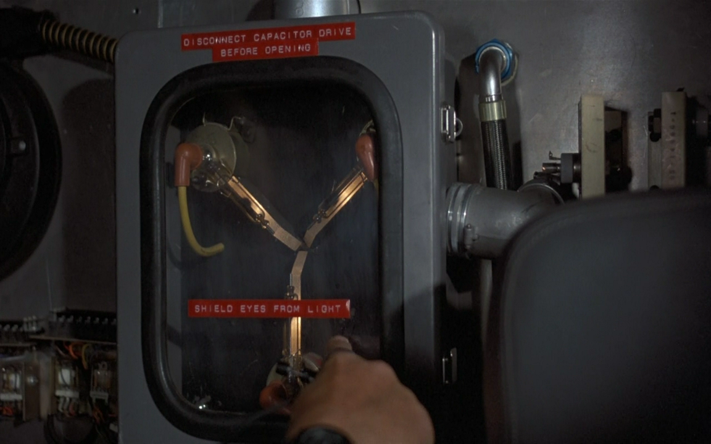

!SLIDE
# merge vs. rebase

!SLIDE
# i rebase all the time
## unless i have to merge

!SLIDE smbullets incremental
# which means i don't pull
* (that's not true, but i don't nearly as often as [roy](http://twitter.com/roykolak) does)

!SLIDE center
# sexy is...

## commit logs

!SLIDE
# merges don't give you either

!SLIDE commandline
# merge
    $ git log
    commit 833328djkslj35f58edc2c8ef3f72e21659ae976
    Merge: c6ff987 5fc7389
    Author: Another Person <some_dude@somewhere.com>
    Date:   Thu Apr 22 14:20:15 2010 -0500

        Merge branch 'some_branch'

        * some_branch:
        Minor variable name change
        Removing duplication
        Corrected examples
        Updated this other thing
        Adding files

        Conflicts:
        spec/one_of_the_specs.rb

!SLIDE
# vs.

!SLIDE commandline
# normal
 
 
 
    $ git log
    commit 63822392389sjdslsjkl54fa65b8a8a363a17e35
    Author: Some Person <someone@somedomain.com>
    Date:   Mon Jun 29 16:21:36 2009 -0400

        Fixing the coverage task for the current setup

!SLIDE
# merge
## is like a zipper

!SLIDE

!SLIDE
# rebase
## is like a flux capacitor

!SLIDE

!SLIDE smbullets incremental
# that makes no sense
* unless you understand the fundamentals
* ...and you've seen ["Back to the Future"](http://www.imdb.com/title/tt0088763/)

!SLIDE
# this will feel tangential
### but stick with me
