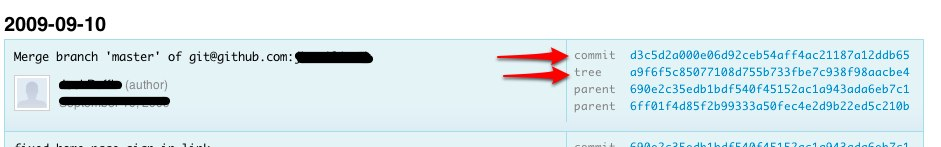
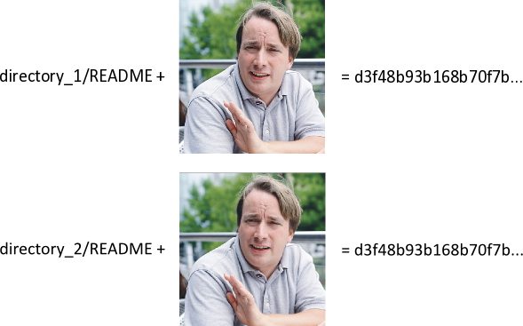
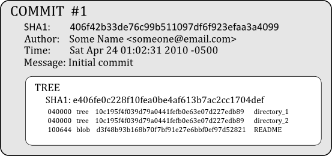

!SLIDE
# there are 3 components
## to a git repository
### (basically)

!SLIDE
# you often see two of them

!SLIDE
# blobs, trees, commits

!SLIDE
# blobs
## SHA1 hash of file size & contents
### same content == same blob

!SLIDE
# example
### (you can follow along at home)

!SLIDE commandline incremental
    $ mkdir new_project
    $ cd new_project
    $ mkdir directory_1
    $ mkdir directory_2

    $ echo 'Content of README' > directory_1/README
    $ echo 'Content of README' > directory_2/README

    $ git hash-object directory_1/README
    d3f48b93b168b70f7bf91e27e6bbf0ef97d52821

    $ git hash-object directory_2/README
    d3f48b93b168b70f7bf91e27e6bbf0ef97d52821

    $ # [note: created git repository w/ a single commit]
    $ git cat-file blob d3f48b93
    Content of README

!SLIDE center

!SLIDE bullets incremental
# blobs
## takeaway:
* sha1 of file content
* therefore, blobs can have same sha1
* (that's important)

!SLIDE
# blobs, trees, commits

!SLIDE
# trees
## think of them as directories
### (collection of multiple sub-nodes)

!SLIDE
# each commit has one
### composed of either sub-trees or blobs
### (id is collective sha1 of sub-node sha1s & filenames)

!SLIDE commandline incremental small
# in our example
    $ git ls-tree  HEAD
    040000 tree 10c195f4f039d79a0441fefb0e63e07d227edb89    directory_1
    040000 tree 10c195f4f039d79a0441fefb0e63e07d227edb89    directory_2
                ^^^^^^^^^^^^^^ SAME??! ^^^^^^^^^^^^^^^^^    ^^^ DIFFERENT?

    $ git ls-tree 10c195f4f039d79a0441fefb0e63e07d227edb89
    100644 blob d3f48b93b168b70f7bf91e27e6bbf0ef97d52821    README
           ^^^^

!SLIDE center
# pop quiz

!SLIDE commandline small
    $ mkdir directory_3

    $ echo 'Content of README' > directory_3/different_file_name
                                             ^^^^^^ NOTE ^^^^^^^

    $ git add . && git commit -a -m"Added new file in directory_3"

    $ git ls-tree HEAD
    040000 tree 10c195f4f039d79a0441fefb0e63e07d227edb89    directory_1
    040000 tree 10c195f4f039d79a0441fefb0e63e07d227edb89    directory_2
    040000 tree 56b93cce25073a26c67c07d7fe0b744668bf0d32    directory_3
                ^^^^^^^^^^^^^^ DIFFERENT? ^^^^^^^^^^^^^^

                                  WHY?

!SLIDE commandline incremental small
# look at the trees
    $ git ls-tree 10c195f4f039d79a0441fefb0e63e07d227edb89
    100644 blob d3f48b93b168b70f7bf91e27e6bbf0ef97d52821    README
                ^^^^^^^^^^^^^^^^^^^^^^^^^^^^^^^^^^^^^^^^

    $ git ls-tree 56b93cce25073a26c67c07d7fe0b744668bf0d32
    100644 blob d3f48b93b168b70f7bf91e27e6bbf0ef97d52821    different_file_name
                ^^^^^^^^^^^^^^^^^^^^^^^^^^^^^^^^^^^^^^^^    ^^^^^^^^^^^^^^^^^^^

    The tree-level sha1 takes the sub-component names into account...
    but the blob computation doesn't
    ...it's only on file size/contents

    (i'm not sure about file mode...but you get the point)

!SLIDE smbullets incremental
# tree takeaways
* basically directories...contents can be other trees or blobs
* sha1s computed off of sub-components' sha1s/names
* difference in tree sha1s means they have different content
* (that last one is important)

!SLIDE incremental bullets
# blobs, trees, commits
* these are easy ;-)

!SLIDE bullets incremental
## commits are composed of:
* the (single) top-level tree sha1
* the name/email of the committer
* the time
* the 'parent' & 'committer' may play in as well...not sure
* (it really doesn't matter)

!SLIDE 
# commits
## takeaway:
### changing any of the components results in a different commit id
### (which makes it a different commit to git)

!SLIDE center

