!SLIDE
## back to zippers & flux capacitors

!SLIDE center
# let's make an example
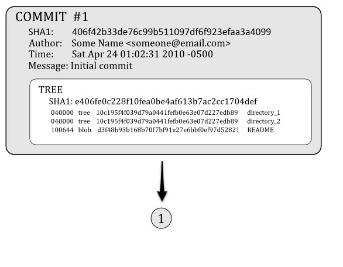

!SLIDE center

!SLIDE center

!SLIDE center
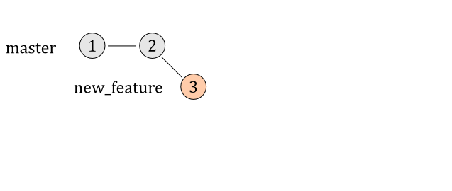

!SLIDE center
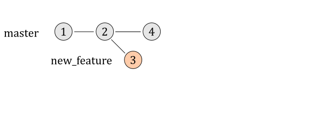

!SLIDE center
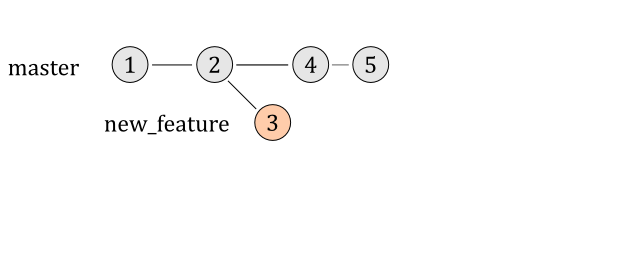

!SLIDE center
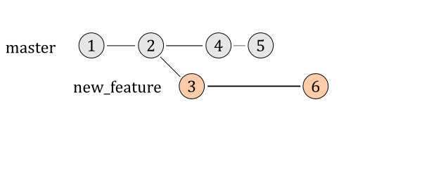

!SLIDE center
## assume we are on master
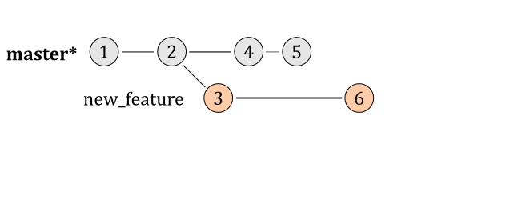

!SLIDE
## and we merge in 'new_feature'

!SLIDE center
## our log looks like this:
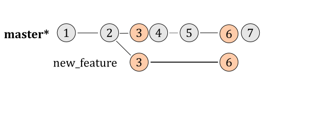

!SLIDE center
## new merge commit added
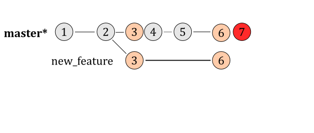

!SLIDE center
## technically, it's this
### (#7 has 2 parents)
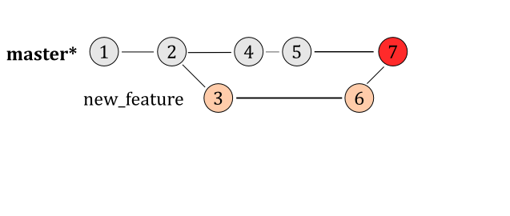

!SLIDE center
# but go back to the log

!SLIDE commandline small
    $ git log --pretty=oneline
    1732fbcdde81cb419b...   Merge branch 'new_feature' into og_master
    fd7e4d48a20a3f0dfe...   new_feature branch: updated directory_1/README  <<<
    fccfb4cb17e63d89b2...   master branch: updated directory_2/README
    d0d98d0c1852d1ba4a...   master branch: updated directory_1/README
    a8f017105dfb3fcd88...   new_feature branch: added readme                <<<
    388d29fe0ee5189be2...   master branch: Added directory_3
    406f42b33de76c99b5...   master branch: Initial commit

!SLIDE center smbullets incremental

## like a zipper
* kind of...right?
* (humor me)

!SLIDE center
#  now...rebasing

!SLIDE center
## assume we're on 'new_feature' branch
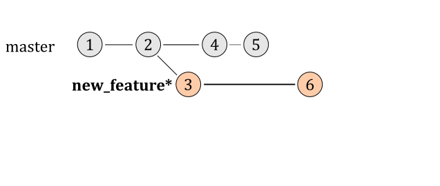

!SLIDE commandline
## and we rebase on top of master
    $ git rebase master

!SLIDE center
## our log looks like this:

!SLIDE center
## technically, it looks like this
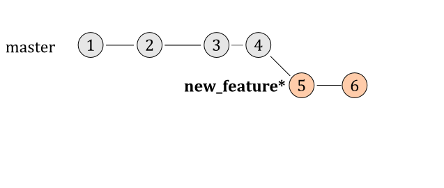

!SLIDE center
# go back to the log again

!SLIDE commandline small
    $ git log --pretty=oneline
    0ddbe1239f5e32ee18... new_feature branch: updated directory_1/README <<<
    31b9f28fe243aa8c2d... new_feature branch: added readme               <<<
    fccfb4cb17e63d89b2... master: updated directory_2/README
    d0d98d0c1852d1ba4a... master: updated directory_1/README
    388d29fe0ee5189be2... Added directory_3
    406f42b33de76c99b5... Initial commit

!SLIDE smbullets incremental
## notable items
* 'new_feature' commits are together in the log (nice)
* 'new_feature' commits have different sha1s now
* (that last one is important ;-))

!SLIDE
## different sha1s are different commits to git
### (therein lies the rub with rebasing)

!SLIDE smbullets incremental
## never rebase on shared commits
### (ever)
* (that's what merging is for)

!SLIDE smbullets incremental
# doing so gives the finger
## to everyone else on the project
* (and is a huge pain to clean up)

!SLIDE
# however
### don't just merge because it's easy

!SLIDE smbullets incremental
## merging generally complicates reading the log
* (which sucks)
* (if you pay attention to the repository log)
* (which you do, right?)

!SLIDE center commandline
# my workflow
## branch off of master
### $ git checkout -b new_feature_branch

!SLIDE smbullets incremental
# commit, commit, commit
* (on new_feature_branch)

!SLIDE center commandline
## frequently switch to master, pull in recent changes
### $ git checkout master
### $ git pull

!SLIDE center
## rebase off of your up-to-date master branch
### $ git checkout new_feature_branch
### $ git rebase master

!SLIDE center smbullets incremental
# when feature is complete
### repeat the pull/rebase process

!SLIDE center
# merge changes into master
### $ git checkout master
### $ git merge new_feature_branch

!SLIDE center smbullets incremental
# if you have conflicts...
* (during the rebase process)

!SLIDE center smbullets incremental
# edit conflicting files and run:
### $ git add [conflicting_file_name]
### $ git rebase --continue
* (this should be pretty easy/rare if you pull often)
* (...like [roy](http://twitter.com/roykolak))
